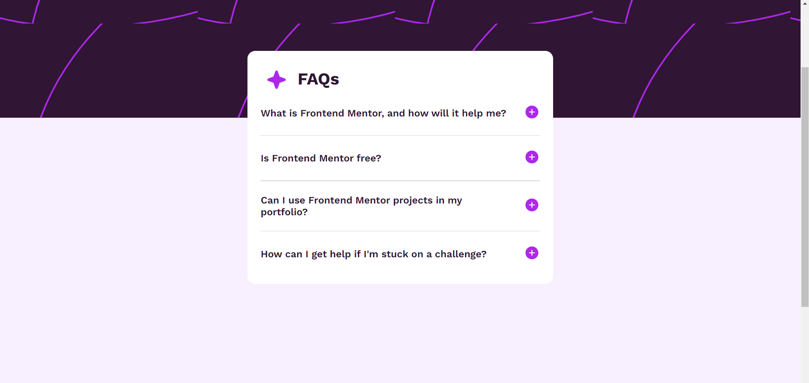
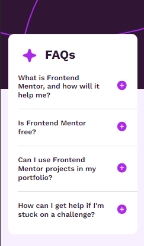

# Frontend Mentor - FAQ accordion solution

This is a solution to the [FAQ accordion challenge on Frontend Mentor](https://www.frontendmentor.io/challenges/faq-accordion-wyfFdeBwBz). Frontend Mentor challenges help you improve your coding skills by building realistic projects.

## Table of contents

- Overview
  it is only an accordian with the functionality of hide and show and with beautiful UI
- The challenge
  the-challenge is build same as a 
  - [Links](https://github.com/vishwajeet-8/Accordian.git)

### The challenge

Users should be able to:

- Hide/Show the answer to a question when the question is clicked
- Navigate the questions and hide/show answers using keyboard navigation alone
- View the optimal layout for the interface depending on their device's screen size
- See hover and focus states for all interactive elements on the page

### Screenshot

- Screenshot
  - 
  - 

### Links

- Live Site URL: [netlify](https://accordian-5500.netlify.app/)

### Built with

- Semantic HTML5 markup
- CSS custom properties
- Flexbox
- Mobile-first workflow

## Author

- vishwajeet rout
- Frontend Mentor - [@vishwajeet-8](https://www.frontendmentor.io/profile/vishwajeet-8)
- Twitter - [@vishwajeetRout](https://twitter.com/vishwajeetRout)
